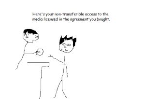

Ownership, it’s a tricky thing in the digital era but things could and should be better.
License for personal use: When you go out and buy a cd or a dvd it turns out you’re only buying a license so that you can use it at home, alone, never lending, and a long list of other things that you apparently agree to not doing when you buy it.

I don’t remember signing anything at the store, I handed over my cash and they gave me a physical product, I now own that product, so I should be able to do whatever I want with it, not so.

Now this is old news, pretty much everyone already grudgingly accepts this as how it is.

But if you think about it, ok, so I bought a license to listen to this music and was provided a cd as the medium to access that licensed content, so if it get’s a scratch on it or just stops working(try playing a vhs tape from 20 years ago, it won’t) then I should be given a replacement. I bought a license so I should be able to listen to my music whenever I want, so when their provided media breaks then they need to provide me with a new one!

not so.

They argue that the license was only for that cd, well that means I did buy the cd? 

This piece isn’t trying to validate piracy in any respect, I’m just pointing out how things don’t go both ways between the consumer and the distributor.

This site could easily be a post a day detailing everything blatantly wrong and morally incorrect about media, copyright, distribution, etc but this has all been said by many people before me so I will leave it up to you to look further into the subject so that when it comes up in conversation you can give everyone a lesson on how we’re being screwed.

