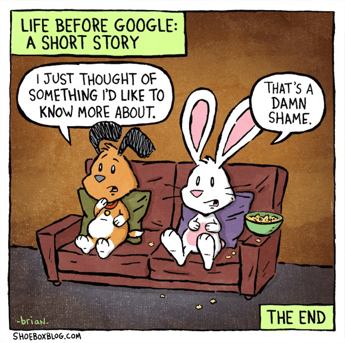

Go back 15 years in your life, unless you were on the bleeding edge you probably didn’t have an internet connection, so when you’d think, I wonder why this happens, I wonder what that’s called, what film have I seen him in before? Not alot probably.
Isn’t it wonderful how with modern days human right of internet connectivity we can instantly abate that curiosity in mere seconds of taps on a device smaller than our hand?

Yes it is, it would be great if we used it a little more to extend our knowledge in more useful areas but that’s another argument entirely.

Want to know why your computer does that annoying thing, stick a brief description into a search engine and oh what a surprise the same thing happened to hundreds of others and oh look someone managed to fix it, excellent.

Want to know what other films an actor has been in, oh look someone kindly wrote up everything about every last appearance said actor made.

It’s hard not to sound sarcastic and go into an RIAA blessing “nothing should be free” rant but I’m genuinely in awe at how easy we have it for solving problems and expanding our knowledge. And it’s all thanks to those few individuals who know the answers that actually share this knowledge with the rest of us.

And that’s the best thing about todays internet it genuinely feels free, when you ask a question on a forum, they don’t reply, visit these 3 sites and click some ads and then I’ll tell you, no they just tell you and they’re happy to do so.

It’s hard to find the reason why people, who in normal life would never consider doing their job for free, then login and provide so much.

So basically what I’m trying to say is, thank you to everyone who shares their knowledge with the rest of us, without these acts the internet would be a very different place.

p.s. thanks to brian from [shoeboxblog](http://www.shoeboxblog.com/) for letting me use the image.

