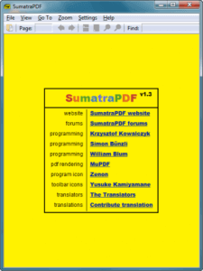

I’ve decided to take this site in a slightly different direction, It’s going to be more computer oriented i.e. tutorials, recommended programs, recommended purchases, etc.
And today as a quick practice while I prepare more in depth articles I will be talking about sumatra pdf reader.

Now you’ll be thinking but I’ve already got a pdf reader! no, you haven’t, that Adobe program that takes 10 minutes to open and then another 20 to install updates is not acceptable and it’s a shame that it’s the go to pdf program seeing as windows doesn’t even come with one installed.

So, sumatra, well it’s free and it’s fast, no, I mean it, like really fast.

It has all the standard features of a pdf reader but who cares, it opens them and can print them, job done so go get it and realise you didn’t hate pdfs for the format but from opening them in a rubbish program.

[DOWNLOAD](http://blog.kowalczyk.info/software/sumatrapdf/free-pdf-reader.html)
