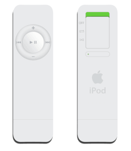
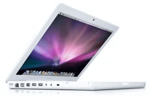
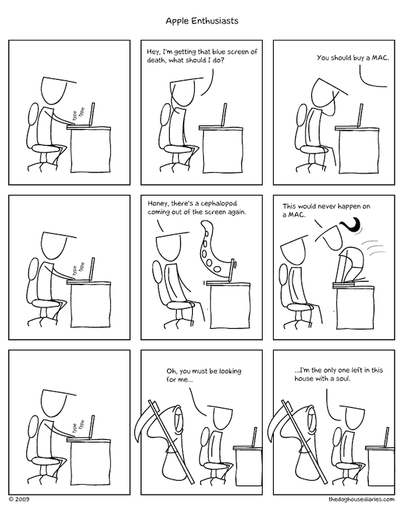

I’m not anti-apple, not even in the slightest. I’ve owned apple products ever since the first iPod Shuffle.

And apart from suddenly having to use a specific program to put music on my mp3 player it was a great experience, good battery life, decent audio quality, well built and stylish at the time.

It wasn’t long until my music library was growing way too fast for that little stick of white plastic to handle so I was lucky enough to be able to move up to the then called “ipod video” and my satisfaction in apple products grew even more.

Since then I’ve had an ipod classic, 2 generations of ipod touchs and a more recent gen shuffle, but the adoption doesn’t end with me, my whole family now owns their own ipod touch and several gens of ipod to choose from for music, we even took the leap last year with the ipad.

Now what’s blatantly missing from this love affair is any mention of mac computers and that leads me to the point of this post. Finally I’m able to give a decent opinion of the mystery behind apples computers.

So what changed? well nothing really, I’d never buy a mac, no matter how justifiable the price is, so I haven’t. It turns out my library at uni has a program for allowing students free loaning of laptops and for whatever absurd reason think it’s necessary for half of those to be macs.

So after just 4 days on the waiting list I was granted my macbook for 15 days, the current gen white macbook to be exact.

I’m not going to go into much detail but needless to say I was quickly impressed, It’s all about the subtleties that I won’t bother mentioning seeing as how if you own a mac you already know what I’d say and if you’re a non-user I doubt anything anyone could say would sway you towards osx.

What I am going to mention though is that this seems like the best generation of macbook for me to have stumbled across, the new trackpad really does make all the difference, effortlessly gliding around while web browsing brings a whole new level of satisfaction. The unibody construction gives you the feeling of one solid piece of kit that you interact with, no annoying creaks to be heard here. The smaller screen, yet higher resolution than most 15.4″ pc laptops shows there’s no skimping on the spec.

All in all I can understand why people choose to spend their money on macs, it’s not a decision I personally would make, I’d never buy the most expensive car, the most expensive tv, the most expensive fridge so why should I buy the most expensive computer? But I now see macs as the best computers partly justifying why they’re the most expensive.

And so here I leave you, I have to return this tomorrow and go back to my Windows 7 netbook which works perfectly fine but just lacks that *grimace* “Magic”.

Big thanks to [The Doghouse Diaries](http://www.thedoghousediaries.com/) for letting me use the comic strip!

