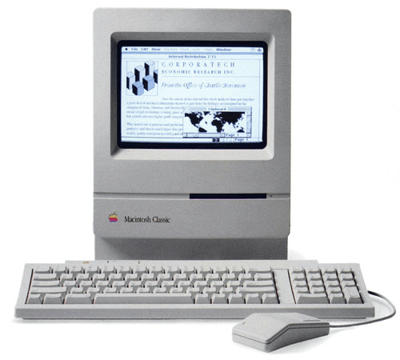
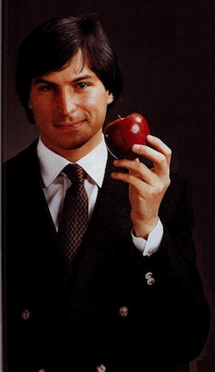

The first computer I ever used was a Macintosh Classic.

This was during the first rise when if you wanted a computer that works then you had to get a Mac, so that’s what we had at home.

I don’t remember anything about using it, just where it was in the house, but I hate to think what I might have become if that had been an IBM or whatever other home “computers” were available at the time because I believe that thanks to that first contact with a computer done right sparked my interest in technology, you can apply the same logic to the fact that my first t shirt had a skateboarder on it.

It was a long time until I encountered another Apple product and that story has already been told, but every single new product gave me that spark all over again, possibilities increased tremendously by a product that at a glance is no different than the competition.

But it is different, you can see the care that went into it, the unstopping quest for perfection and ease of use.

It’s hard to explain, but you can feel the difference just by thinking about the product, be it an iPod, iPhone, iPad or Mac.

That difference is Steve Jobs.

