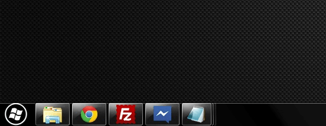

Today is a quick post on adding that personal touch to your Windows 7 PC, changing the start menu orb!

There’s not a lot you can customize on a Windows 7 desktop so I quite like the touch that a different start button orb gives and can be something that grabs the attention of anyone who uses your computer.

Swapping the orb out for a new one couldn’t be easier, with the help of a easy to use program created by a user at [thewindowsclub.com](http://thewindowsclub.com) you can quickly backup your current orb and try a new one. The program comes with a few sample orbs and you can get it from the download link at the bottom of the page.

Now you may find that the few replacements  that come with said program aren’t unique enough well lucky enough users over at [DeviantArt](http://browse.deviantart.com/customization/?q=start%20orb&order=9&offset=0) have made a whole range of unique orbs for you to try.

And if you can’t find what you’re looking for you can always create your own,  ZaliTH over at [sevenforums](http://www.sevenforums.com/) wrote a really in-depth [tutorial](http://www.sevenforums.com/tutorials/73616-how-create-custom-start-orb-image.html) on how to do exactly that, it involves creating an image with the 3 steps that make up a start orb, static, hover and active. This can be seen in the following example of a start orb replacement image.

[DOWNLOAD WINDOWS 7 START BUTTON CHANGER](http://www.thewindowsclub.com/windows-7-start-button-changer-released)