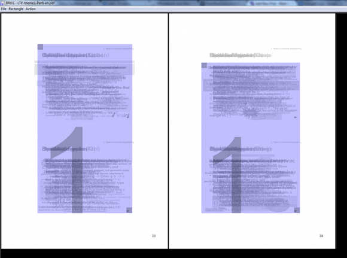
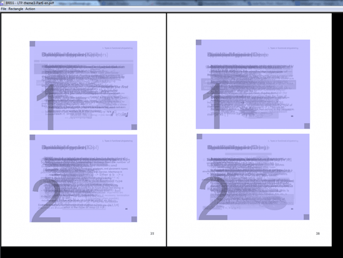

I'm back again after a while with some new help for manipulating those annoying PDF files.

If you're a Student like I am then you will have probably come across when your professors make their class material available to download as a PDF. These tend to be Powerpoint slides that have been exported as a PDF, now I don't know the reasoning but sometimes you find that the PDF you've been provided with has multiple Powerpoint slides on each page of the PDF. If you've never come across this then you may be wondering what could be wrong with that, well it makes visualizing them on smaller screens like tablets quite annoying, what you want is to have one slide for each page and then by default what you view will be resized in a readable manner.

So, how do you get around this? It's actually really simple thanks to an open source program called Briss.

How does it work? well once you download Briss, from the link provided at the end of this page, you unzip it and then execute the program directly without having to install it.

Next you click on "File", "Load File" and then browse to the PDF you want to crop. A pop up will appear asking about "Enter pages to be excluded from merging" just hit cancel to load the whole PDF.
Once it has opened the PDF you'll be presented with what makes this program so powerful yet easy to use.

What you should see is one or multiple pages of the PDF with some blue boxes over the text, don't worry if the text looks scrambled behind the blue boxes.

Now how this works is you drag and resize the blue boxes over the content that you want to make up a page, you can create more blue boxes by just clicking then dragging where there isn't already a blue box. This allows you to also divide single slides into multiple pages.

Once you have the blue boxes sorted you can either preview the changes or save the cropped PDF using the "Action" tab of the program.

And that's it, hopefully you will find this useful.

[DOWNLOAD BRISS](http://sourceforge.net/projects/briss/)