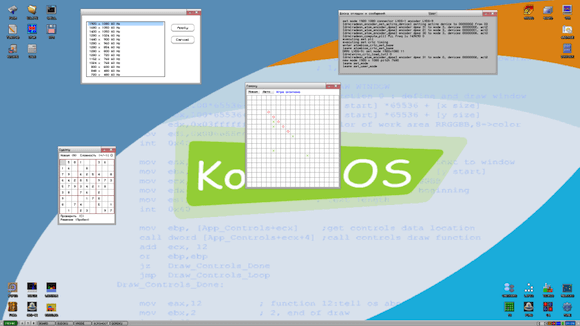

To round off **2012** I'm going to finally get around to mentioning an amazing project I stumbled across several years ago.

**Kolibri OS** is an x86 Operating System, it comes with over 200 programs covering file managers, calculator, calendar, performance monitors, gpu stress tests, web browser, irc client, ftp clients and servers, word processor, mp3 player, 3D games like doom and quake, DOSbox, ZX spectrum, NES and scummvm emulators, the list is pretty big.

Now you thinking "but any linux distro has all this and more!" and you'd be right but Kolibris OS is very different.

<b>Kolibri OS is written entirely in Assembler code.</b>

Now once you get over how ludicrous that sounds I can start mentioning why on earth you would do this.

Well for starters the entire OS with those 200 programs fits on a Floppy disk, the entire download with installers and a plethora of skins is only 3.4MB!

I'm running it off a USB flash drive on a 10 year old **500Mhz pentium III** and it boots in 2 seconds, I'm not joking, once the post screen shows up it is literally 2 seconds until **Kolibri** is completely booted and ready to go, then opening any program is instant.

I could spend hours gushing over this marvel but the only way you'll understand where I'm coming from is by trying it out for yourself. So here are some brief steps to get you started running **Kolibri OS** from a USB flash drive by using windows 32 bit.

1. Download **Kolibri OS** from their website, <http://kolibrios.org/en/> you're going to want to grab the **Floppy disk image.**

2. Prepare a **USB** flash drive that is formatted to fat32.

3. Extract the downloaded .7z archive and navigate to "kolibri_0.7.7.0_img_enHD_loadUSB_Boot" and run **"inst.exe"** a window will open listing drive letters, double click the letter that is your flash drive and pop up will show up if the process was successful.

4. Copy the file "BOOT_F32.BIN" and "kolibri.img"(situated in "kolibri_0.7.7.0_img_en"  to the pen drive and you're good to go!

5. Restart and boot from the flash drive and prepare to be impressed by **Kolibri OS.**

