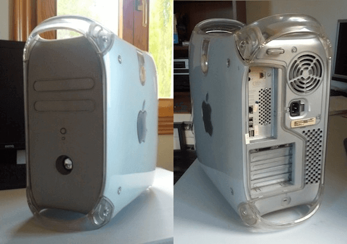
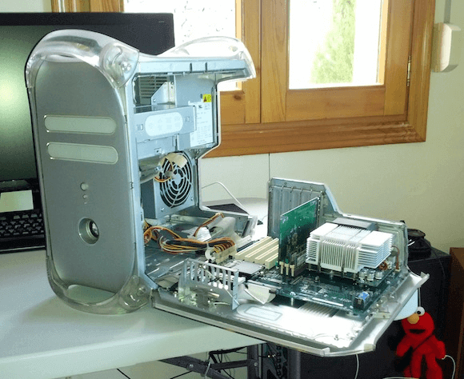
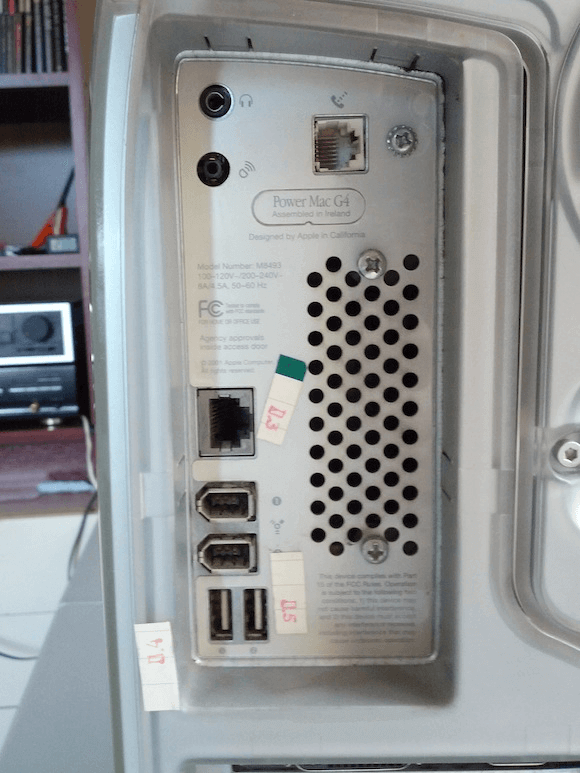
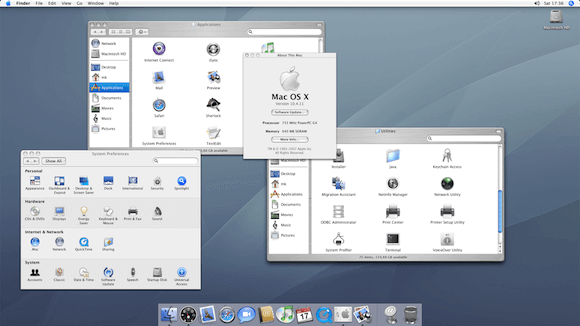
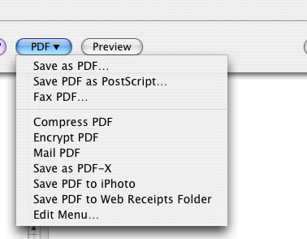
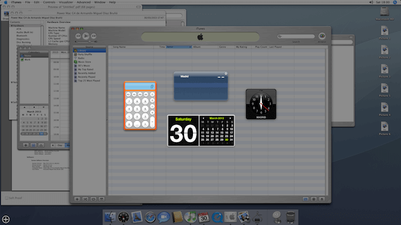

I was lucky enough to receive some old tech to tinker with, to be exact, a 2001 Power Mac G4. Now this is a pretty old computer by today's standards(they hadn't even switched to intel yet, hence the name Power Mac as it uses a [PowerPC processor](http://en.wikipedia.org/wiki/PowerPC)) but it still chugs along with OSX and is perfectly usable. It's also an interesting piece of hardware with it's signature design and classic looks while holding some unique engineering ideas.

On the front we can see the dual bay covers, the power and reset buttons and then below them a big speaker, I've always thought that desktops should have a minimal speaker just for system sounds so of course Apple were way ahead of me on that front.

On the back we have the IO panel, The graphics card panel, 4 expansion slot covers and the out and in air grills. 

One of the coolest things about this hardware is the way that you can open the box by just pulling on a lever and the whole right side folds down to reveal the insides of the computer, this makes cleaning and installing new hardware really simple.

To finish up with the external hardware we'll take a little look at the back panel to see what sort of IO we have available.

So what have we got, well on the top left we have the headphone and microphone plugs, then on the right we have the modem plug. Further down, below all the small print we can find a Gigabit Ethernet port(yes, I checked, it actually has Gigabit ethernet!), 2x Firewire 400 ports and 2x USB 1.1 ports. I feel I should also mention that the PowerMac also includes a b draft wifi card screwed to the motherboard.

Now let's switch it on and see what this thing can do.

The Power Mac is currently running OSX 10.4 so the UI may look a bit different than what you maybe used to but I assure you that nearly all of the default funcionality is already there and has been for who knows how long before even this computer.

An excellent example is the built-in print to PDF funcionality.

So… performance? well for what it has under the hood it actually runs quite well, compared to a Celeron 800 desktop I have on hand the PowerMac is by far more fluid and responsive.

This particular model is running a single core 733Mhz PowerPC CPU alongside 640MB of SDRAM, no DDR here, and to finish off we have an nVIDIA GeForce2 graphics card packing 32MB of memory and connected using the AGP interface.

Back to the OS, I was completely unaware that so much of the signature OSX funcionality was already present so far back, like for example the Dashboard and Exposé.

I'll continue to have a play around with the PowerMac, try out some software and see if it can still be used as a legitimate machine for getting work done.

Be sure to thank [@mkprojeckt](http://twitter.com/mkprojeckt) on Twitter for being so kind as to donate the PowerMac.

