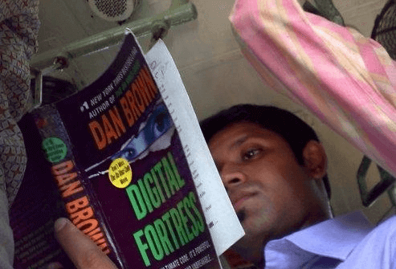

There's a lot to talk about when we bring up the concept of digital media, something I have many opinions on. Today I'm only going to go into one facet of this heated debate.

**"Why don't digital downloads cost less than their physical counterparts?"**

Now this seems like quite an obvious argument, take for example any music cd, the physical offering requires manufacturing, shipping and then a store to display it in! So surely a digital download must be cheaper, a single copy on a server for the whole world to enjoy.
We can apply the same logic to movies, books, magazines and anything else we can digitize and distribute. 

Oh, but servers cost money, and the underlying technology will have license fees and then the power and support needed to keep it running **24/7** all has to be taken into consideration. But I'm not arguing whether this tips the scales in order to make digital downloads the more expensive medium to offer, no, I'm here to propose an idea that isn't quite so obvious. I'll demonstrate the general idea with the following images.

Oh look he's reading a Dan Brown book, which one is that? ah yes "Digital Fortress", I don't think I've read that one but I really enjoyed his other books.

Now let's have a look at what it'll be like when someone reads the next Dan Brown book.

Oh looks she's reading…wait, what on earth is she reading? Now you may not care, but the company that published whatever she's reading definitely does care about the fact that you don't know, they relied on every sale of that book to then lead on to a possible number of others seeing them reading that book, be interested, and maybe end up buying it themselves.

This is the **crux** of my view, digital downloads have wiped out enormous advertising streams. When you go round to your friend's house and see their cd rack and realise, "hey  there's that Adele lady, maybe I should check her out". When someone walks out of blockbuster holding the latest Batman movie or sitting on a bench skimming the latest issue of GQ, all this is providing an incredible amount of advertising and when you go digital, this all dissapears.

This is also incredibly **powerful** advertising, the kind social media sites are desperately trying to duplicate, trustworthy recommendations, not, buy this because we say so banner ads.

So my theory is that digital download prices are set where they are because the distributors are forced to try and offset the lost knock on sales that the physical offering provided.

