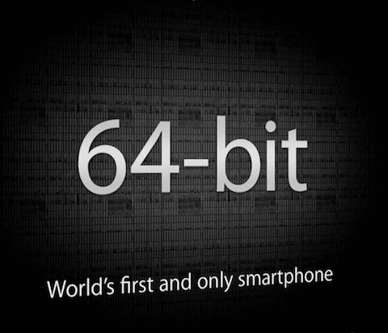

Earlier this month, **Apple** unveiled their latest iPhone and one of the most interesting things from the keynote was the fact that they have now moved to a 64 bit CPU.

It comes as no surprise that Apple were the first to make the switch seeing as 10 years ago at WWDC 2003 they uneveiled the first **desktop** computer with a 64 bit CPU.

The surprise was when people were against this change and called it a gimmick, mostly centered on the **short sighted** thought that all a 64 bit CPU provides is more addressing space and thus allowing more than 4GB of RAM. Being able to have more than 4GB of RAM in a mobile device seemed silly when the iPhone **still** chugs along just fine with 1GB of RAM.

**There really is a lot more to it than just a wider addressing space.**

[Mike Ash]("https://twitter.com/mikeash") has written a great [article]("http://www.mikeash.com/pyblog/friday-qa-2013-09-27-arm64-and-you.html")
 with the basics of what 64 bit ARM actually brings to the table and rather than paraphrase anything from his excellent write up, I **insist** that you go read it, understand it and then be excited for how quickly we got here.

