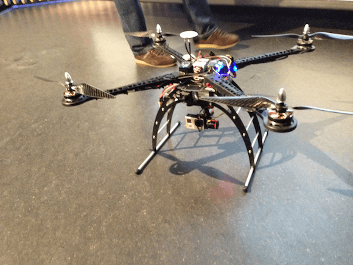

Today I attended a series of talks related to Android at the **Madrid** edition of DroidCon 2013.

This came about thanks to my University that organised the travel and tickets while giving **50 people** the chance to go at no cost.

After the 5 hour bus ride, the morning started off with a talk centered on the new types of apps that **Google Glass** will allow, they called it a completely different device category with a whole new set of ideas for apps. I disagree, most of what they were working on were **apps** that already existed except with Glass now they're easier to use because it leaves your hands free.

A high point was that they had a prototype quadricopter drone that they are developing jointly with the red cross for surveying disaster struck areas.

It includes a GoPro mounted on a gyroscope so no matter how erratic the flying may be the image stays steady making it easier to effectively survey the area.

The second talk I attended was the one I was most looking forward to. It was on **Volley** which is a new framework announced at this years I/O and it provides simpler and faster data transfers. When Volley was announced at I/O I instantly wanted to use it in the app I was working on but it had little to no documentation. I was hoping this might have changed 7 months later but to my dismay, on the powerpoint slide listing the downsides to Volley, the only item was "No documentation". 

The rest of the talks were pretty dissapointing, mostly companies pushing their products rather than inspiring us or providing us with new ideas. 

Another cool moment was that for some reason there was an **Oculus Rift** set up with a full cockpit and iRacing. The Oculus definitely does a great job at providing an immersive experience but I found the resolution incredibly low and made it quite hard to use.

To end with, it was interesting to see that even in **Spain**, the majority of the developers present were coding on a Macbook, taking photos with their iPad and messaging on their iPhone. There was also a small group of diehard Blackberry users doing their best to convince the Android users to make the switch while still being able to develop for Android.

