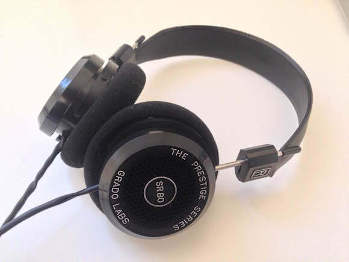
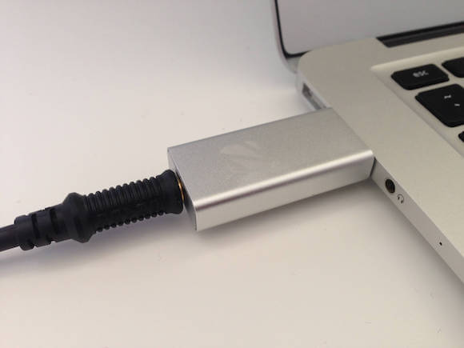

I'm a big music fan and when most of your life is spent sat in front of a screen well then you have to find a great soundtrack. For me that means an ever growing and evolving music collection. But as you start to listen to a lot of digital music you begin to wonder whether you should be considering the quality of your listening experience. 

The first step is usually to start worrying about the bit rate of your collection and maybe turning to lossless rips. Usually what will happen next is that you'll be listening to a song in your upgraded collection and suddenly realise, hey I never heard that instrument before. 

A lot of work goes into making music, but so much of it can be lost through poor reproduction. Once you first encounter this you will start to worry about what else you might be missing.

My journey began several years ago but it wasn't until last year when I was finally able to seriously invest in my setup. It started with some headphones from the brand [Grado](http://www.gradolabs.com/index.php), in particular the [SR80 model](http://www.gradolabs.com/headphones/prestige-series/item/1-sr80e).

The special thing about these headphones is that they are open backed which provides an incredibly wide soundscape that puts you in the center of the music. An important thing to note though is that being open backed these headphones are not suitable for use in public as there is a substantial amount of sound leakage.

So now I had high quality digital representations of my music and also some upmarket headphones for getting the analogue waves to my ears. The next logical step is to start worrying about what handles the part inbetween. That is, the part that converts the digital files to analogue signals, this is called the Digital Audio Converter or **DAC**.

Now DACs don't come cheap and can carry a price tag in the thousands. For a long time I had my eyes on the [D1 model](http://audioengineusa.com/Store/Digital-Audio-Converters) by **Audio Engine**, a simple enough piece of kit that you plug into the USB port of your computer and is then used to power your headphones. But I could never take the plunge because the price was out of my reach and so I continued to worry about my subpar listening experience.

That was until I came across an Indiegogo project for a USB DAC that I could afford! It was the [ZuperDAC](https://www.indiegogo.com/projects/zuperdac-portable-hifi-music-anytime-anywhere/x/10466974#/story) by **Zorloo**. They were promising a high quality DAC packaged entirely in a product the size of a USB pen drive. The fact that the ZuperDAC would be natively supported by **OS X** and **iOS** was enough to sell me on the idea.

The downside to kickstarter, indiegogo, etc. style purchases is that at the time you're only buying into the idea, next you have to wait for the actual product to be created before it can be shipped. But after several months of anxiously waiting I now have my hands on a silver ZuperDAC

Setting up the ZuperDAC couldn't be simpler, all it takes is plugging one end into a USB port on your computer and then your headphones into the other end. The *USB Audio* output is automatically detected by **OS X** so all you have to do is press play and start looking out for more hidden sounds in your music collection.

I'm still going through my favourite tracks but I have already been able to pick out parts of songs I'd never noticed before so I have to say that using a USB DAC has definitely been a noticeable step up for me.

Got any recommendations for what you think I should add next to my audio setup? [Please let me know!
](mailto:mark@partiallogic.com)

