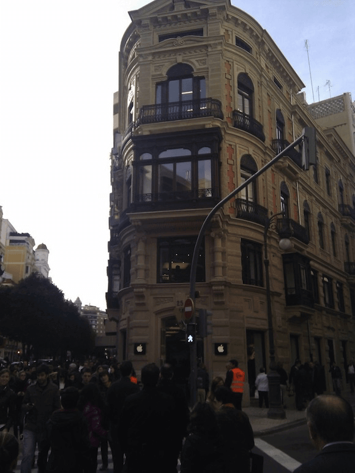
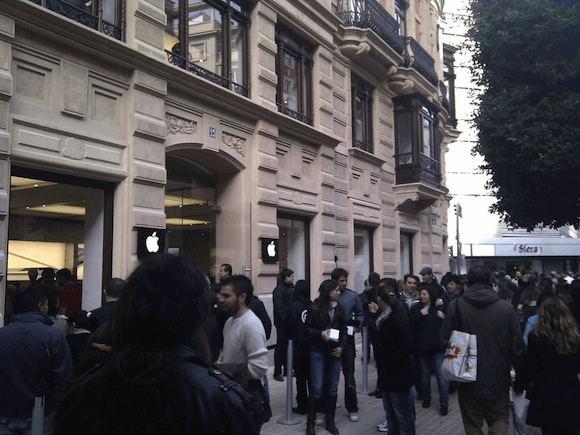

Today is the opening day of the Apple Store here in Valencia.
It’s also a landmark for Spain as the first store following Apples tradition of acquiring a locale of distinguished antiquity and renovating it.

It’s located on the main shopping street of colon a place that is always bustling with people so they have done, as always, a great job on positioning themselves.

But I’m not here to talk about the shop, I didn’t even go inside and that’s what this is about.

To begin with there was a line that went right around the block, for a shop! even if there hadn’t been a line I doubt I would have gone in as the place was packed as it is, now I just can’t understand the why, these products are already sold everywhere, everyone has used all these products before, so why the hysteria? And it’s not that people just want to have a play, 1 out of 3 were walking out having bought something, seriously does simply opening a store mean people will automatically decide to start buying Apple products?

And don’t start thinking “oh well they must have been having opening specials” no, Apple hasn’t and never will have opening day specials, this mass of people outweighing any sales that I’ve seen are here because…well I don’t know why they’re there. It was hard not to laugh at the whole thing, watching the employees high five everyone as they were herded in, people walking around wide eyed at products that have been available from months to years. And it didn’t take me long to deduce something from all this, these are those same people that click on google ads, those people that obey orders that you and I can’t see, I actually found them, they exist.