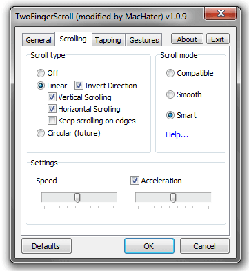

If there was something that stood out the most to people when they have a go on a mac it’s how damn smooth the scrolling is, especially 2 finger scrolling using the trackpad. It didn’t take long for oems to realise they ought to add this functionality as Microsoft certainly wasn’t going to. But this turned out to be such an awfuly jerky, jumpy experience that most would deactivate the option, until now.

Forum member MacHater over at [notebookreview](http://forum.notebookreview.com/) has released a stand alone program that greatly improves trackpad scrolling on windows pcs. It’s called TwoFingerScroll and allows heavy tweaking of the sensibility and whether to allow horizontal scrolling and even circular scrolling. You can also configure a variety of 2 and 3 finger gestures like 3 finger swipes for alt+tab providing a lion like window switcher.

I highly recommend this for any laptop user and you can grab it from the link below:

[DOWNLOAD](http://forum.notebookreview.com/hp-drivers-software-forum/552462-twofingerscroll-two-finger-scrolling-done-right-more.html)