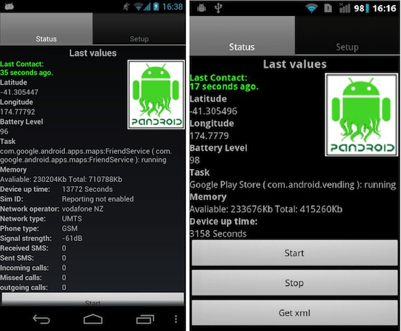

Mid term evaluation is coming up soon so working hard at cleaning up code as I can be quite messy while trying to get things to work. Also was starting to realise that alot of the modules I’ve been adding are sim card dependent so I’ve added seperate views depending on whether the device has a sim card or not.

