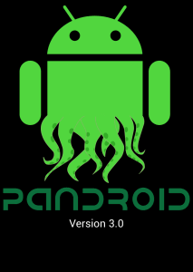

This years Google Summer of Code is drawing to a close, I’ve finalised all the functionality of my project and now it’s crossing fingers that I don’t hear back about any bugs.

This week coming I’ll be providing my final evaluation and by next week it will all be over.

It’s been a fun journey, having learnt so much along the way that I now consider myself a  more accomplished programmer, but of course at the same time I’ve learnt a lot about how I can improve for next time!

You can try out my app right now by grabbing the pandroid apk file from [here](https://dl.dropboxusercontent.com/u/17033926/partiallogic/Pandroid%20Agent%20v3.0.apk) and if you notice anything you don’t like, please [let me know!](http://twitter.com/_markholland)

And of course a huge shout out to [Sancho Lerena](http://twitter.com/slerena), [Sergio Martin Zarzuelo](http://www.noparar.com/) and everyone else at [PandoraFMS](http://www.pandorafms.com/) for giving me the opportunity to work with them.