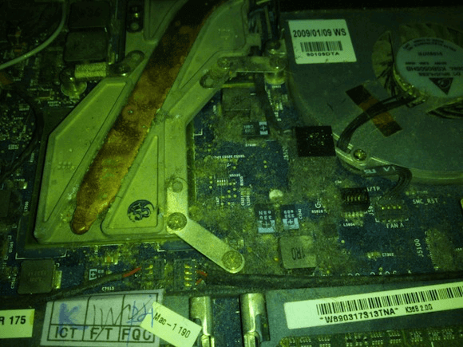

You know what I haven't done in a while? Let you guys know how much I'm enjoying having a Macbook and the way it has improved my productivity and outlook on what a computer experience should be like.

But today I won't be talking about the why but the how I reached this point, because in a way, I may have cheated slightly by doing everything I can think of to get the most performance out of the Macbook that I have. If I hadn't done everything I discuss, then my opinion of OSX may be a little different.

 

So let's start with what I'm working with, I have an "Early 2009" white Macbook, this is the pre-unibody model with a Core 2 Duo processor.  The state I received it in was with the stock 2GB of RAM and the 80GB mechanical hard disk along with a faulty disk drive and no working speakers.

But obviously I wasn't going to let this Macbook live on without trying to up some of these specs. The first thing I did was stick in a spare sata II SSD, that made a difference and the whole system became instantly more usable and piqued my interest to see what else could be done.

My next acquisition was a RAM upgrade to 4GB, unluckily, this laptop is still using DDR2 technology which is quite a bit more expensive than the current mass produced DDR3 technology. But as soon as I'd put the new modules in the change was definitely notable and pushed the laptop from being "usable" to actually becoming a valid machine to get some work done on.

 

I kept it like this for several months without any more changes, during this time I was able to become more familiar with OSX and all it's subtleties that just make you think "of course it does that, why wouldn't it?" and then "why doesn't everything do this?". This kept going until I was no longer using my other laptop, a 2012 Thinkpad with all the bells and whistles, a great laptop, but I just wasn't as productive on it. Then more recently I was finding that when I was sat at my desk using my desktop PC I'd find I'd rather be doing the same work but on my Macbook. This lead me to my most recent string of changes.

After realising that I could just connect the Macbook to my desktop monitor and see if I actually would be more productive, I ran out that same day to the local Apple store and picked up the mini-dvi to dvi adapter. Now I must mention that my local Apple store has barely been open a year, yet it had in stock an adapter that was superseded by mini display port adapters way back in '09. So I got home and hooked it up and quickly realised that this was the perfect setup for getting work done and has made me fully believe that the desktop isn't the way to go, a single machine in your laptop and then a hub at home for providing a larger workspace.

Now being an old Laptop, it has old technology and old technology tends to have trouble running the latest OS and software. Well my Macbook is no exception and it can tend to get a little hot when doing too much at once. I'd read a lot about Macbooks sometimes overheating but they always quoted numbers in the 90 plus degrees when idle, this definitely didn't apply to my situation but I was still curious if anything could be done. I eventually cracked and decided to replace the thermal paste on the processor and graphics, this would be my first time replacing thermal paste on a laptop so I was little unsure if was taking one too many risks. I couldn't have been more wrong, I'd already dismantled the Macbook many times before, it gets pretty dusty in there as you can see below but removing the heat sink was just one more quick step and I was good to go.

 

So what are the results, well, idle temperatures have dropped 10 degrees to below 50ºC. Now for a 65nm die inside a laptop this is pretty decent, obviously under load those temperatures can still rise pretty quickly but I've found that I can now do some light web browsing on the sofa without melting my thighs, a huge plus and made the risk truly worth it.

You may remember that I mentioned that when I received the laptop the speakers weren't working, well this was due to a problem where the optical audio connector(Macbooks have optical???) at the back of the headphone socket is permanently on from grime getting in there and causing the switch to stick. On several occasions I had attempted to resolve this problem by poking around a bit with the stick of a cotton bud but to no avail. While still on a high of having successfully replaced the thermal paste I decided to give it another shot. So I took a safety pin and bent the end into a little hook, now the good thing about the audio socket problem is that seeing as the optical signal is always on this means that the red light is always on and sufficiently illuminates the inside of the socket so that you can identify the different contacts and switches. I was able to hook under the switch for the optical audio which can be found right at the back of the socket and gave it a good tugging and to my relief the red light switched off and stayed off, I hit the volume keys and lo' and behold I had sound.

And that brings me up to today. Where I'm sat at my desk writing this on the external monitor that's connected to the Macbook while watching the legend Dave Grohl give his SXSW keynote on the screen below.

I have some remaining ideas to further improve on my work so far, but they require monetary investment and that is always a tough decision, just how deep a hole to dig. What I'd love to do is come across a trackpad from a Macbook pro from the same year. Although at first sight they may seem identical, the pro has multi-touch gestures and I  just know that 4 finger spaces switching would bring a whole new level to my workflow. And while we're at it, a new battery would be great, not that there's much wrong with this one relatively speaking, its solid 3 hours of duration puts it in line with most budget laptops, but with 700+ cycles and 81% of the original capacity indicates that I could have a lot more. Sometime I wonder about fixing the optical drive as I'm sure that it's possible but I just know that I would never use it. One of the first things I did to the laptop was remove the optical disk drive completely, I can't stand the noise it makes every time you switch on the Macbook.

 

 

I never could have done anything without the great info provided by the following sources:

- [ifixit guide](http://www.ifixit.com/Device/Mac) to taking apart the Macbook.

- [This crude drawing](http://www.facebook.com/photo.php?fbid=10150168825311304&set=a.10150168825306304.300375.599361303&type=1&theater) of the inside of a headphone jack by Katherine Bruens.

And countless other threads on [macrumors](http://www.macrumors.com/) and [stackoverflow](http://stackoverflow.com/) that provided those morsals of information that made all this possible.